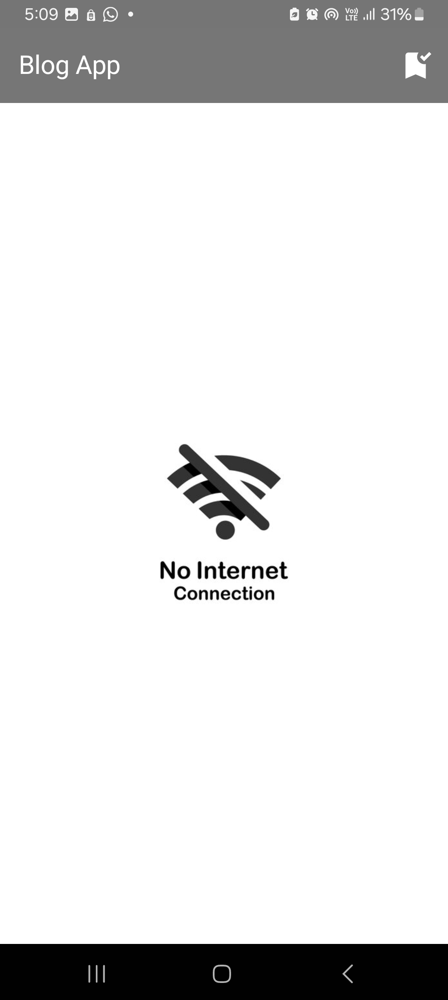

# BlogApp

### ⚒️ Architecture

BlogApp follows the principles of Clean Architecture.

## Screenshots

<video src="Screenshots/screen_recording.mp4" width="250" controls></video>

### 👨‍💻 Tech stack

| Tools               |                                 Link                                 |
|:--------------------|:--------------------------------------------------------------------:|
| 🤖  Language        |                   [Kotlin](https://kotlinlang.org)                   |
| 💉  UI              |                         [Jetpack Compose]()                          |
| 🧭  Navigation      |     [Compose Navigation](https://github.com/Tlaster/PreCompose)      |
| 🧶  Multi-threading | [Kotlin Coroutines](https://developer.android.com/kotlin/coroutines) |

